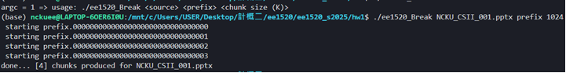
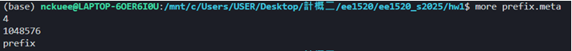
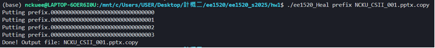
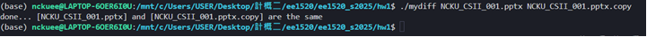
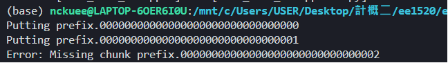
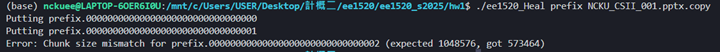

# EE1520 Spring 2025 - Homework #1 Report

## 學號：E14116697  
## 姓名：蕭義賢 

---

## Part 1 — myHeal 程式設計與實作

在此部分，實作了 ee1520_Heal.c，目的是根據 ee1520_Break 所產生的區塊與 meta 檔案，將原始檔案還原。實作過程中我們處理了以下幾項功能與檢查：

### 功能說明

- 根據 meta 檔案讀取：
  - 區塊總數
  - 區塊大小（以 byte 表示）
  - 區塊前綴名稱
- 依序開啟各個區塊檔案，並寫入還原檔案中
- 檢查每個區塊實際大小是否與預期一致（除最後一個區塊外）

### 錯誤檢查

1. **缺少區塊檢查（1%）**  
   當區塊檔案不存在時，會印出錯誤訊息並終止程式執行。

2. **區塊大小錯誤檢查（1%）**  
   對於非最後一個區塊，如果實際大小與預期不符，則印出錯誤訊息並結束。

## 執行流程

### Part 1 執行 ：

1. **成功使用 `ee1520_Break` 將檔案切割成區塊**  
   - 使用指令：`./ee1520_Break NCKU_CSII_001.pptx prefix 1024`
   - 成功產出 meta file 以及 4 個區塊檔案。

2. **查看 meta file，確認內容正確**
   - `prefix.meta` 顯示：
     - chunk 數量為 `4`
     - chunk 大小為 `1048576`（即 1MB）
     - prefix 為 `prefix`

3. **使用 `ee1520_Heal` 正確重建檔案**
   - 指令：`./ee1520_Heal prefix NCKU_CSII_001.pptx.copy`
   - 成功重建檔案並使用 `mydiff` 驗證與原始檔案相同。

### Part 1 額外測試（錯誤檢查功能）

你也做了兩種錯誤測試，這正好對應作業說明要求的兩個檢查功能：

1. **Chunk missing detected（1%）**
   - 錯誤訊息：`Error: Missing chunk prefix.00000000000000000000000000000002`
   - 表示成功觸發並處理了「缺少區塊」的檢查機制。

2. **Chunk size mismatched（1%，除了最後一塊）**
   - 錯誤訊息：`Error: Chunk size mismatch for prefix.00000000000000000000000000000002 (expected 1048576, got 573464)`
   - 成功檢查「區塊大小不符」的情況。

## Part 2 

在傳統操作流程中，使用者需要先使用 `myHeal` 將所有區塊復原後，才能使用原始檔案。然而，這樣的操作在只需使用檔案部分內容時顯得低效。因此，本部分提出一種高層次設計架構，讓使用者能夠在不還原完整檔案的情況下直接存取部分區塊資料。

### 設計概念說明

僅於需要時才讀取對應區塊檔案。設計步驟如下：

1. **讀取 meta 檔案**，取得：
   - 區塊總數
   - 區塊大小
   - 檔名前綴 prefix
2. **依據欲存取的 offset 計算出目標區塊編號**
3. **讀取對應區塊檔案的內容**
4. **回傳指定位移的資料，模擬標準檔案的 `read()` 行為**
